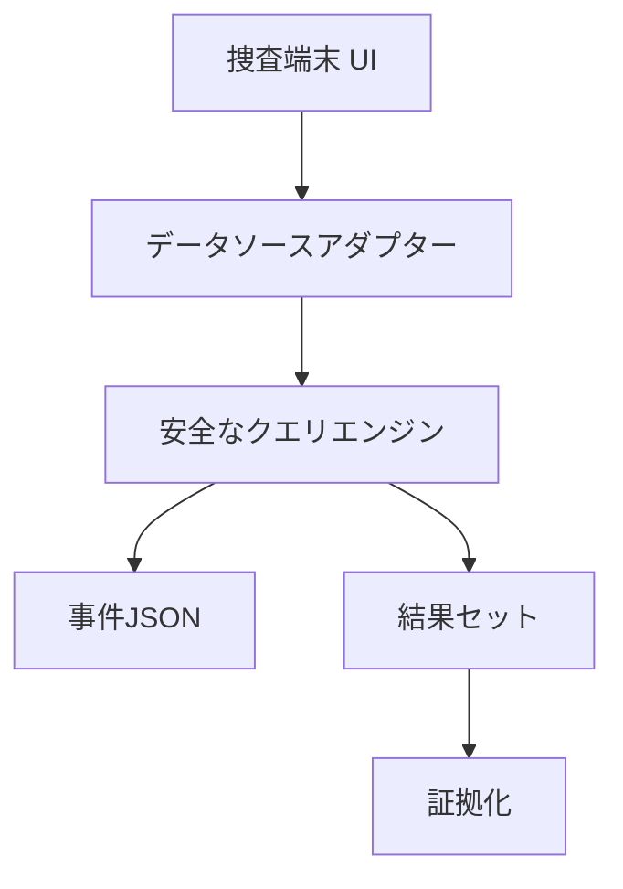

# DATABASE DESIGN

## 方針

ブラウザから実DBへ任意クエリを送らない。事件ごとのJSONを読み込み、各データソース専用アダプターが許可済み構文だけを解釈する。



## M01のSQL風構文

```sql
SELECT * | column[, column]
FROM table
[WHERE column = value];
```

`eval` やブラウザ内SQLiteは使用しない。字句を限定した正規表現パーサーで処理する。将来はPEGパーサーへ置換可能。

## M02のアダプター

| ID | 表現 | 例 |
| --- | --- | --- |
| hotel | SQL | `SELECT * FROM rooms` |
| access | 検索式 | `room:404 AND time:[22:00 TO 23:00]` |
| camera | タイムライン | カメラ・時間帯・人物タグ |
| payment | フィルター | 金額、端末、決済手段 |
| facility | 時系列 | メトリクスと時間範囲 |
| staff | グラフ | 人物から部署・権限を探索 |

CAMERA / PAYMENT / STAFFのフォームは、許可されたキーと文字列値だけのJSONをアダプターへ渡す。CAMERAは`camera_id` / `person_tag` / `start` / `end`、PAYMENTは`terminal` / `method` / `min` / `max`、STAFFは`node_id`を使用する。未知キー・不足キー・不正な型はエラー。値をコードやSQLとして評価しない。

STAFFは人物と部署／権限の間の関係レコードを保持し、選択ノードに接続する関係だけを返す。探索方向が変わっても関係の`_recordId`は変わらないため、同じ関係の証拠を重複登録しない。

## 証拠の安定性

証拠は表示中の行番号ではなく、事件ファイルで定義した不変IDを参照する。データ表示順が変わってもセーブデータを壊さない。

## セーブデータ

初期版は `localStorage` を使用し、次を保存する。

M03実装済みのキーは`null-case:case-001:investigation`。`schemaVersion: 1`、`caseId: "case-001"`、`caseSchemaVersion: 1`、`discoveredIds`、`evidenceIds`、`history`を保持する。履歴はソースIDと実行した検索条件（最新100件、1件最大10,000文字）。登録済みIDは発見済みIDの部分集合であることを検証する。証拠本文は保存せず、復元時に事件データのカタログから再構築する。

`migrateSave`がバージョン境界を担当する。M02には永続化形式がなかったため、現在受け入れるのはv1のみ。破損、未知ID、異なる事件、未対応バージョンは復元せず、自動保存も停止して元データを保護する。容量不足や保存禁止でもメモリ上の操作は継続する。同時に複数タブからの更新を統合する処理は未対応。

以下は今後を含めた保存対象で、ボード・推理下書き・ヒント使用数はそれぞれの機能実装時に追加する。

- caseId / schemaVersion
- 発見済み証拠ID
- 実行済みクエリの履歴
- ケースボードのノード座標と接続
- 推理提出の下書き
- ヒント使用回数

事件ファイルとセーブデータには別のバージョン番号を持たせ、移行関数を用意する。
